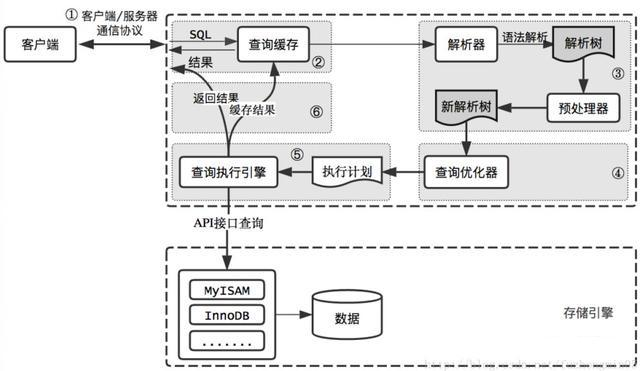

# NOTE

|序号|描述|地址|
|:--:|:--:|:--|
|1|java & jvm|https://docs.oracle.com/javase/specs/index.html|
|2|docsify|https://docsify.js.org/#/zh-cn/quickstart|
|3|iconfont|[https://www.iconfont.cn/](https://www.iconfont.cn/)|
|4|hammerspoon|[http://www.hammerspoon.org/go/](http://www.hammerspoon.org/go/)|
|5|mvnrepo|[https://mvnrepository.com](https://mvnrepository.com)|
|6|mybatis-plus|[https://mp.baomidou.com/guide/](https://mp.baomidou.com/guide/)|
|7|fonta-wesome|[https://fontawesome.dashgame.com/](https://fontawesome.dashgame.com/)|
|8|jedis|[https://tool.oschina.net/uploads/apidocs/](https://tool.oschina.net/uploads/apidocs/)|
|9|vue|[https://cn.vuejs.org/v2/guide/](https://cn.vuejs.org/v2/guide/)|

# VIM

## 自定义配置

> MACOS上ideavimrc的默认地址：~/.ideavimrc

``` 
set scrolloff=5
set hlsearch
set ignorecase
set keep-english-in-normal

nmap c ^
nmap C $
nmap r *
nmap R :noh<CR>
nmap <CR> o<ESC>
```

# Hammerspoon

这不是Hammerspoon的基本教程文档，只是整理了一些已经编写好的基于lua脚本的源代码，这些代码可以直接在Hammerspoon中加载运行，如果您想更多地了解Hammerspoon的使用方法和体验其强大的自动化扩展功能，您可以访问其官网的[快速开始](http://www.hammerspoon.org/go/)和[API文档](http://www.hammerspoon.org/docs/index.html)。

## 全局变量

``` lua
-- 提示窗口显示时长，单位为秒
alert_time = 0.5
-- 调节音量和屏幕亮度的步长，步长越大，每调节一次的变化范围就越大
step = 2
```

## 公共方法

``` lua
function alertMsg(key, value)
    hs.alert.closeAll()
    hs.alert.show(key .. ' ' .. value .. '%', alert_time)
end

function alertMsgP(key, value)
    hs.alert.closeAll()
    hs.alert.show(key .. ' ' .. value, alert_time)
end
```

## 普通方法

### 控制音量

``` lua
function changeVolume(nv)
    return function()
        volume = hs.audiodevice.defaultOutputDevice():volume() + nv
        if volume <= 0 then
            volume = 0
            hs.audiodevice.defaultOutputDevice():setMuted(true)
        end
        if volume > 0 then
            hs.audiodevice.defaultOutputDevice():setMuted(false)
        end
        if volume >= 100 then volume = 100 end
        hs.audiodevice.defaultOutputDevice():setVolume(volume)
        alertMsg('Volume', math.ceil(volume))
    end
end

hs.hotkey.bind({'ctrl', 'alt'}, 'up', changeVolume(step))
hs.hotkey.bind({'ctrl', 'alt'}, 'down', changeVolume(-step))
```

### 控制屏幕亮度

``` lua
function changeBrightness(nv)
    return function()
        brightness = hs.brightness.get() + nv
        if brightness <= 0 then brightness = 5 end
        if brightness >= 100 then brightness = 100 end
        hs.brightness.set(brightness)
        alertMsg('Brightness', math.ceil(brightness))
    end
end

hs.hotkey.bind({'ctrl', 'alt'}, 'left', changeBrightness(-step))
hs.hotkey.bind({'ctrl', 'alt'}, 'right', changeBrightness(step))
```

### 控制窗口位置

``` lua
function position(p)
    return function()
        local win = hs.window.focusedWindow()
        local f = win:frame()
        local screen = win:screen()
        local max = screen:frame()
        if p == 'left' then
            f.x = max.x
            f.y = max.y
            f.w = max.w / 2
            f.h = max.h
        elseif p == 'right' then
            f.x = max.w / 2
            f.y = max.y
            f.w = max.w / 2
            f.h = max.h
        elseif p == 'up' then
            f.x = max.x
            f.y = max.y
            f.w = max.w
            f.h = max.h / 2
        elseif p == 'down' then
            f.x = max.x
            f.y = max.h / 2
            f.w = max.w
            f.h = max.h / 2
            win:setFrame(f)
        elseif p == 'return' then
            if f.w == max.w and f.h == max.h then
                f.x = max.w / 4
                f.y = max.h / 4
                f.w = max.w / 2
                f.h = max.h / 2
            else
                f.x = max.x
                f.y = max.y
                f.w = max.w
                f.h = max.h
            end
        end
        win:setFrame(f)
    end
end

hs.hotkey.bind({'ctrl', 'cmd'}, 'up', position('up'))
hs.hotkey.bind({'ctrl', 'cmd'}, 'down', position('down'))
hs.hotkey.bind({'ctrl', 'cmd'}, 'left', position('left'))
hs.hotkey.bind({'ctrl', 'cmd'}, 'right', position('right'))
hs.hotkey.bind({'ctrl', 'cmd'}, 'return', position('return'))
```

# MongoDB

## 基础查询

| 条件 | 说明 | 示例             |
|-----|-----|------------------|
|$gt|大于|{'age':{$gt:18}}|
|$gte|大于等于|{'age':{$gte:18}}|
|$lt|小于|{'age':{$lt:30}}|
|$lte|小于等于|{'age':{$lte:30}}|
|$ne|不等于|{'username':{$ne:'刘德华'}}|
|$in|与字段值包含在指定数组中的文档匹配|{'username':{$in:['赵本山', '刘德华', '成龙']}}|
|$nin|与字段值不包含在指定数组中的文档匹配|{'username':{$nin:['赵本山', '刘德华', '成龙']}}|
|$or|使用逻辑或连接查询子句，并返回符合任何一个子句条件的文档|{'username':{$or:['赵本山', '刘德华']}}|
|$and|使用逻辑与连接子句，并返回两个子句条件都匹配的文档|{$and:[{username': 赵本山'}, {age':18}]}|
|$not|反转查询表达多，返回与查询表达式不匹配的文档|{$not:{username': 赵本山'}}|
|$nor|使用逻辑或非连接查询子句，返回两个子句都不匹配的文档|{$nor:{age':{$gt:18}}, username': 刘德华'}|
|$exists|匹配包含字段的文档|{username':{$exists: TRUE}}|
|$type|匹配指定字段为BSON类型的文档|{username':{$type:<BsonType>}}|
|$mod|对执行字段执行求模运算，并返回结果为指定值的文档。求模运算的条件是使用数组指定的，其中第一个数值为除数，第二个数组为余数|{number':{$mod:[2, 0]}}|
|$regex|返回指定字段值与指定正则表达式匹配的文档|{myString':{$regex:come.*.exp'}}|
|$all|返回这样的文档，即其指定数组字段包含所有指定元素|{username':{$all:[one', two', three']}|
|$elemMatch|返回这样的文档，即其指定数组字段至少有一个元素与指定的条件都匹配|{myArr':{$elemMatch:{value':6}, size'24}}|
|$size|返回这样一个文档，即其指定的数组字段为指定的长度|{myArr:{$size:5}}|

# MySql

## 索引

### 索引的作用

* 是一种数据结构，这种结构可以帮助存储引擎快速找到需要的数据记录

### 索引的优点

1. 可以大大减少服务器需要扫描的数据量
2. 帮助服务器避免排序和建立临时表
3. 可以将随机I/O变为顺序I/O

### 索引的缺点

1. 创建索引和维护索引都需要消耗时间，且这种时间消耗将随着数据量的增加而增加
2. 索引需要占用物理空间，除了数据表占用空间之外，每一个索引还需要占用一定的额外物理空间；如果建立聚簇索引则需要的空间
3. 当对表中的数据进行增、删、改操作的时候，索引也要动态维护，这会降低数据的维护速度

### MySql存储引擎

1. MyISAM：查询速度快，有较好的索引优化和数据压缩技术，但不支持事务
2. Innodb：支持事务，并且提供行级锁，是MySql5.5之后的默认存储引擎
3. Memory：适合存储临时数据，实例重启之后数据会丢失
4. Archive：适合存储历史数据

### SQL执行过程



